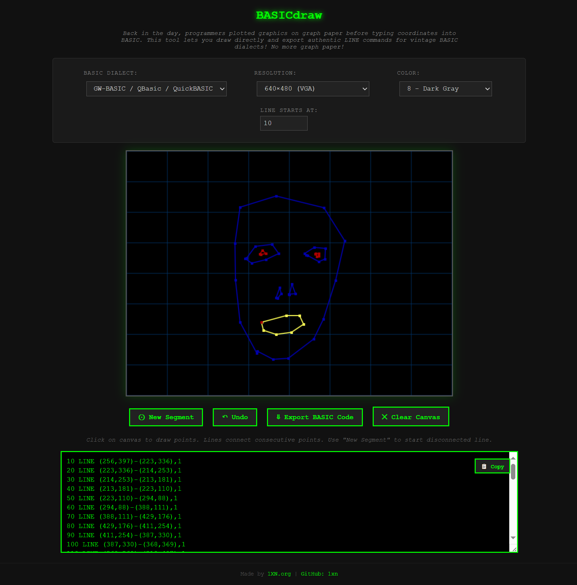
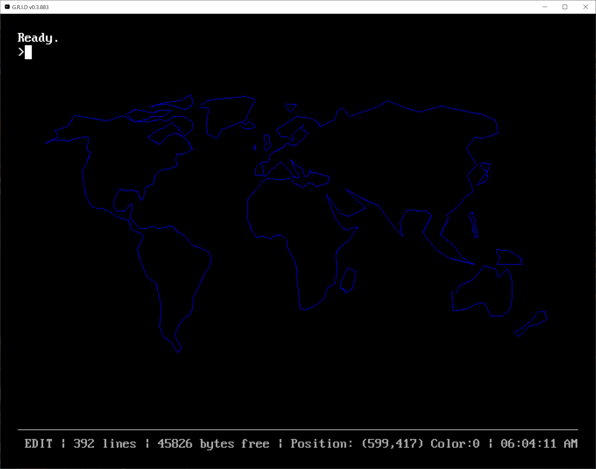

# BASICdraw

Draw lines and export to BASIC LINE commands for vintage computer systems.

A web application that lets you draw lines on a canvas and export them as authentic BASIC LINE commands. Perfect for retro programming enthusiasts who want to create graphics for classic BASIC dialects without manually plotting coordinates on graph paper!

**🌐 [Live Demo](https://basiclinedraw.netlify.app/)**

## Features

- **Interactive Drawing**: Click on the canvas to draw points and connect them with lines
- **Multiple BASIC Dialects**: Supports syntax for various vintage BASIC implementations:
  - GW-BASIC / QBasic / QuickBASIC (default)
  - Atari ST BASIC
  - Sharp MZ-700/800 BASIC
  - MSX BASIC
  - Commodore 128 BASIC 7.0
  - Apple II HPLOT
  - Generic BASIC
- **Multiple Resolutions**: Choose from classic computer resolutions:
  - 256×192 (MSX)
  - 280×192 (Apple II HGR2)
  - 320×200 (CGA/C64/Atari)
  - 640×350 (EGA)
  - 640×400 (Atari ST)
  - 640×480 (VGA)
- **Color Support**: Full EGA/VGA 16-color palette (0-15) with automatic color mapping for each dialect
- **Line Segments**: Create disconnected line segments using the "New Segment" button
- **Undo Functionality**: Remove the last drawn line with the "Undo" button
- **Customizable Line Numbers**: Set the starting line number for exported code
- **One-Click Copy**: Easily copy generated BASIC code to clipboard

## How to Use

1. **Select Your BASIC Dialect**: Choose the target BASIC dialect from the dropdown menu (defaults to GW-BASIC)
2. **Choose Resolution**: Select the appropriate resolution for your target system (automatically filtered based on dialect)
3. **Select Color**: Pick a color from the EGA/VGA palette (0-15) for your drawing
4. **Draw Lines**: Click on the canvas to place points. Consecutive clicks will be connected with lines
5. **Create Segments**: Click "New Segment" to start a disconnected line (useful for drawing separate shapes)
6. **Undo Mistakes**: Use the "Undo" button to remove the last drawn line
7. **Export Code**: Click "Export BASIC Code" to generate the LINE commands
8. **Copy**: Use the copy button to copy the generated code to your clipboard
9. **Clear**: Start over with the "Clear Canvas" button

## Example

Here's an example of creating a drawing with BASICdraw. First, the tool interface showing the drawing canvas with controls:



After drawing and exporting, the generated GW-BASIC code appears in the output area:



The complete GW-BASIC code exported by the tool:

```basic
10 LINE (256,397)-(223,336),1
20 LINE (223,336)-(214,253),1
30 LINE (214,253)-(213,181),1
40 LINE (213,181)-(223,110),1
50 LINE (223,110)-(294,88),1
60 LINE (294,88)-(388,111),1
70 LINE (388,111)-(429,176),1
80 LINE (429,176)-(411,254),1
90 LINE (411,254)-(387,330),1
100 LINE (387,330)-(368,369),1
110 LINE (368,369)-(318,407),1
120 LINE (318,407)-(288,409),1
130 LINE (288,409)-(257,393),1
140 LINE (236,210)-(253,187),1
150 LINE (253,187)-(286,183),1
160 LINE (286,183)-(299,201),1
170 LINE (299,201)-(274,213),1
180 LINE (274,213)-(246,220),1
190 LINE (246,220)-(233,211),1
200 LINE (350,201)-(369,189),1
210 LINE (369,189)-(391,191),1
220 LINE (391,191)-(390,212),1
230 LINE (390,212)-(378,217),1
240 LINE (378,217)-(356,205),1
250 LINE (356,205)-(353,204),1
260 LINE (294,288)-(301,268),1
270 LINE (301,268)-(304,280),1
280 LINE (304,280)-(297,289),1
290 LINE (320,282)-(325,261),1
300 LINE (325,261)-(332,280),1
310 LINE (332,280)-(319,281),1
320 LINE (266,336)-(314,323),14
330 LINE (314,323)-(340,323),14
340 LINE (340,323)-(348,340),14
350 LINE (348,340)-(324,356),14
360 LINE (324,356)-(294,360),14
370 LINE (294,360)-(269,352),14
380 LINE (269,352)-(265,336),14
390 LINE (262,202)-(267,195),4
400 LINE (267,195)-(274,201),4
410 LINE (274,201)-(264,203),4
420 LINE (371,202)-(378,201),4
430 LINE (378,201)-(378,206),4
440 LINE (378,206)-(374,207),4
450 LINE (374,207)-(372,201),4
```

## Technical Details

- **Pure HTML/CSS/JavaScript** - no dependencies required
- **Client-side only** - runs entirely in the browser, no server needed
- **Canvas-based drawing** with coordinate scaling and grid overlay
- **Automatic resolution filtering** based on selected BASIC dialect
- **Color mapping** - EGA/VGA colors automatically mapped to dialect-specific palettes (e.g., Apple II hi-res colors)
- **Optimized exports** - Apple II HPLOT only outputs `HCOLOR=` when color changes

## License

See [LICENSE](LICENSE) file for details.

## Credits
Made by [1XN.org](https://1xn.org) | [GitHub: 1xn](https://github.com/1xn)
